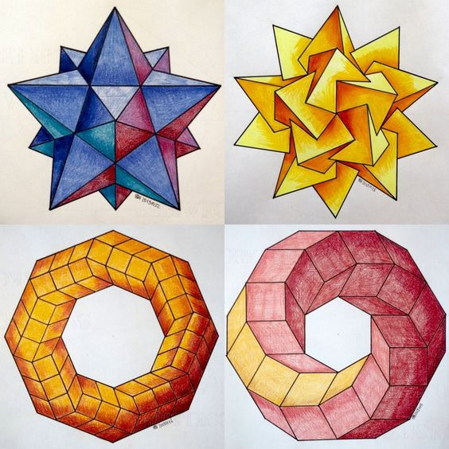
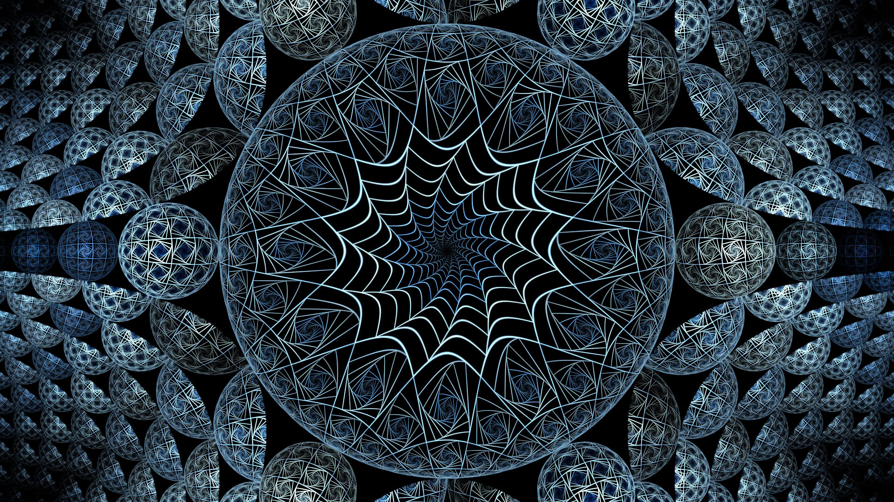
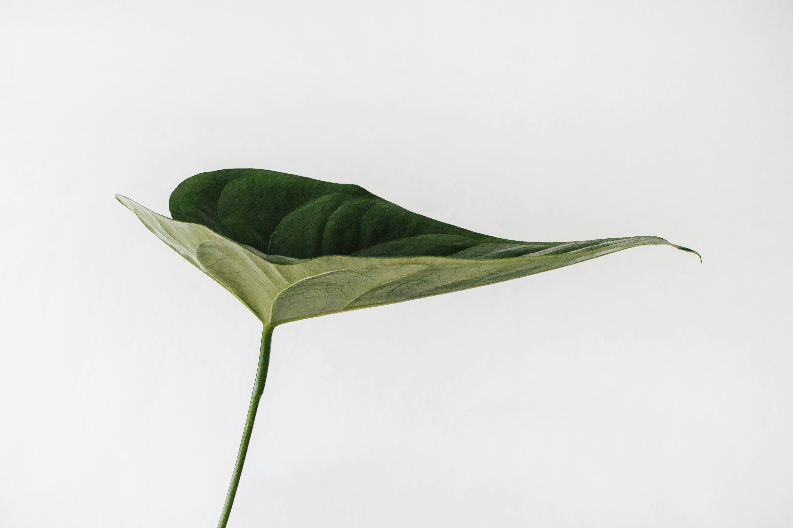
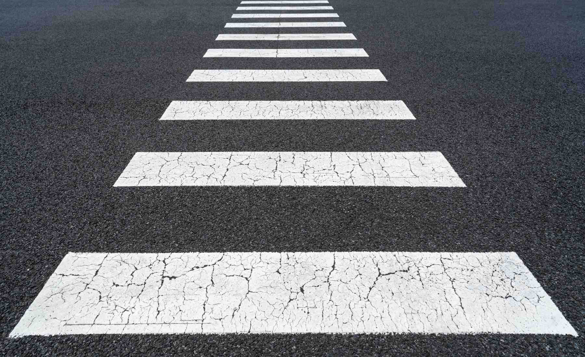
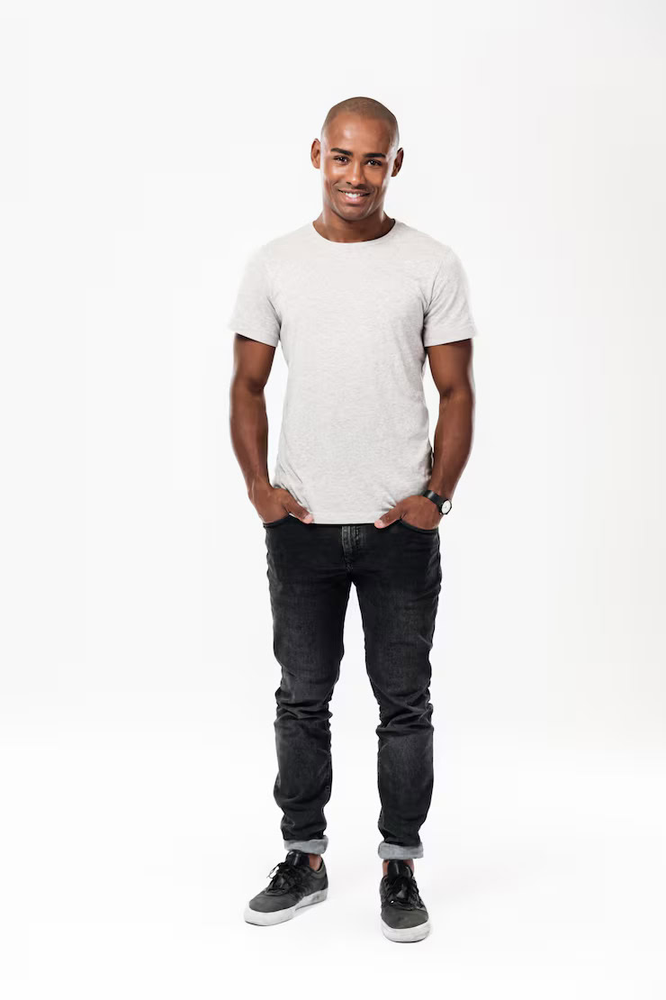
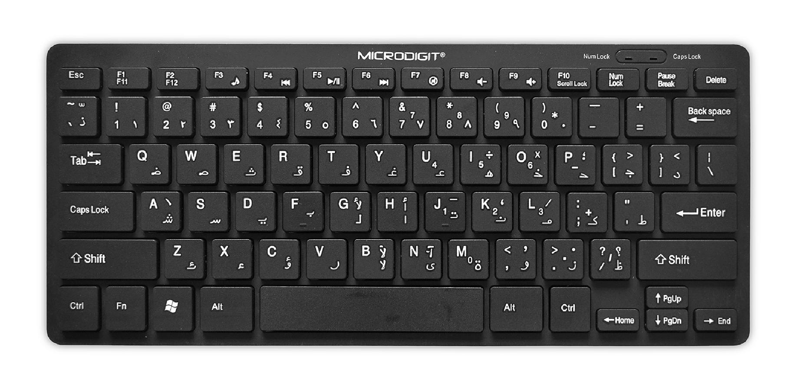
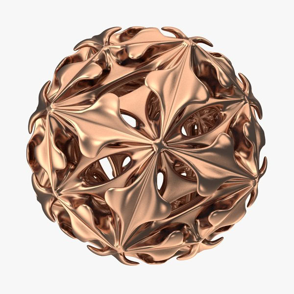
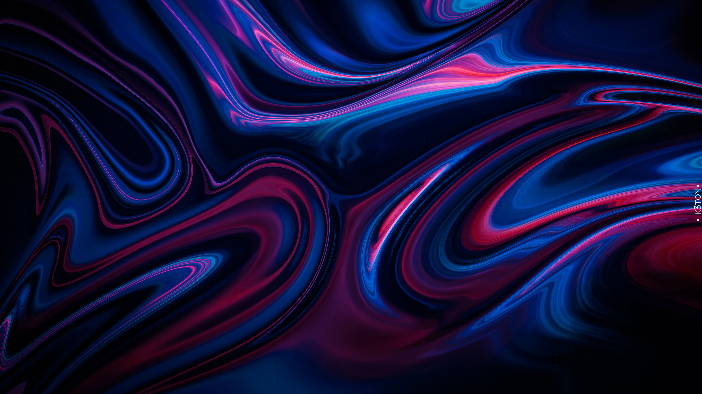
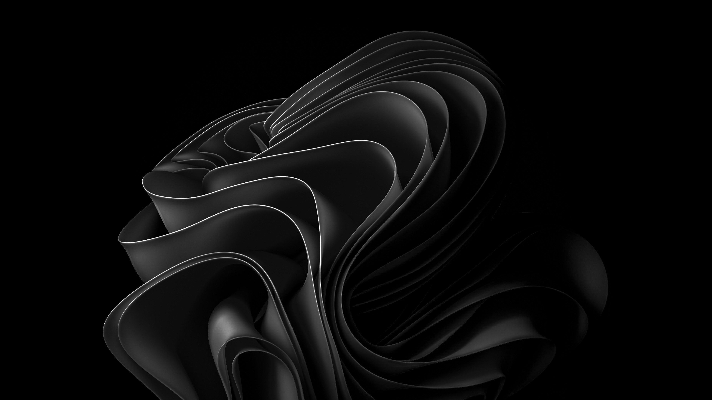

# Image Convolution Benchmark

Implementation of a convolution algorithm in C++ with the intention of using it as a simple means to benchmark CPU performance.

### Index

- [Box Blur](#kernel-box_blur)
- [Emboss](#kernel-emboss)
- [Gaussian](#kernel-gaussian)
- [Ghost](#kernel-ghost)
- [Glitch X](#kernel-glitch_x)
- [Glitch Y](#kernel-glitch_y)
- [Identity](#kernel-identity)
- [Laplacian 3](#kernel-laplacian_3)
- [Laplacian 5](#kernel-laplacian_5)
- [Motion Blur X](#kernel-motion_blur_x)
- [Motion Blur Y](#kernel-motion_blur_y)
- [Sharpen 3](#kernel-sharpen_3)
- [Sharpen 5](#kernel-sharpen_5)
- [Sobel X](#kernel-sobel_x)
- [Sobel Y](#kernel-sobel_y)

<strong>Kernel: box_blur</strong>

| Original | Processed (box_blur) |
| :------: | :-------: |
|  |  |
|  |  |
|  |  |
|  |  |
|  |  |
|  |  |
|  |  |
|  |  |
|  |  |
|  |  |
|  |  |
|  |  |
|  |  |
|  |  |
|  |  |
|  |  |
|  |  |
|  |  |
|  |  |
|  |  |

<strong>Kernel: emboss</strong>

| Original | Processed (emboss) |
| :------: | :-------: |
|  |  |
|  |  |
|  |  |
|  |  |
|  |  |
|  |  |
|  |  |
|  |  |
|  |  |
|  |  |
|  |  |
|  |  |
|  |  |
|  |  |
|  |  |
|  |  |
|  |  |
|  |  |
|  |  |
|  |  |

<strong>Kernel: gaussian</strong>

| Original | Processed (gaussian) |
| :------: | :-------: |
|  |  |
|  |  |
|  |  |
|  |  |
|  |  |
|  |  |
|  |  |
|  |  |
|  |  |
|  |  |
|  |  |
|  |  |
|  |  |
|  |  |
|  |  |
|  |  |
|  |  |
|  |  |
|  |  |
|  |  |

<strong>Kernel: ghost</strong>

| Original | Processed (ghost) |
| :------: | :-------: |
|  |  |
|  |  |
|  |  |
|  |  |
|  |  |
|  |  |
|  |  |
|  |  |
|  |  |
|  |  |
|  |  |
|  |  |
|  |  |
|  |  |
|  |  |
|  |  |
|  |  |
|  |  |
|  |  |
|  |  |

<strong>Kernel: glitch_x</strong>

| Original | Processed (glitch_x) |
| :------: | :-------: |
|  |  |
|  |  |
|  |  |
|  |  |
|  |  |
|  |  |
|  |  |
|  |  |
|  |  |
|  |  |
|  |  |
|  |  |
|  |  |
|  |  |
|  |  |
|  |  |
|  |  |
|  |  |
|  |  |
|  |  |

<strong>Kernel: glitch_y</strong>

| Original | Processed (glitch_y) |
| :------: | :-------: |
|  |  |
|  |  |
|  |  |
|  |  |
|  |  |
|  |  |
|  |  |
|  |  |
|  |  |
|  |  |
|  |  |
|  |  |
|  |  |
|  |  |
|  |  |
|  |  |
|  |  |
|  |  |
|  |  |
|  |  |

<strong>Kernel: identity</strong>

| Original | Processed (identity) |
| :------: | :-------: |
|  |  |
|  |  |
|  |  |
|  |  |
|  |  |
|  |  |
|  |  |
|  |  |
|  |  |
|  |  |
|  |  |
|  |  |
|  |  |
|  |  |
|  |  |
|  |  |
|  |  |
|  |  |
|  |  |
|  |  |

<strong>Kernel: laplacian_3</strong>

| Original | Processed (laplacian_3) |
| :------: | :-------: |
|  |  |
|  |  |
|  |  |
|  |  |
|  |  |
|  |  |
|  |  |
|  |  |
|  |  |
|  |  |
|  |  |
|  |  |
|  |  |
|  |  |
|  |  |
|  |  |
|  |  |
|  |  |
|  |  |
|  |  |

<strong>Kernel: laplacian_5</strong>

| Original | Processed (laplacian_5) |
| :------: | :-------: |
|  |  |
|  |  |
|  |  |
|  |  |
|  |  |
|  |  |
|  |  |
|  |  |
|  |  |
|  |  |
|  |  |
|  |  |
|  |  |
|  |  |
|  |  |
|  |  |
|  |  |
|  |  |
|  |  |
|  |  |

<strong>Kernel: motion_blur_x</strong>

| Original | Processed (motion_blur_x) |
| :------: | :-------: |
|  |  |
|  |  |
|  |  |
|  |  |
|  |  |
|  |  |
|  |  |
|  |  |
|  |  |
|  |  |
|  |  |
|  |  |
|  |  |
|  |  |
|  |  |
|  |  |
|  |  |
|  |  |
|  |  |
|  |  |

<strong>Kernel: motion_blur_y</strong>

| Original | Processed (motion_blur_y) |
| :------: | :-------: |
|  |  |
|  |  |
|  |  |
|  |  |
|  |  |
|  |  |
|  |  |
|  |  |
|  |  |
|  |  |
|  |  |
|  |  |
|  |  |
|  |  |
|  |  |
|  |  |
|  |  |
|  |  |
|  |  |
|  |  |

<strong>Kernel: sharpen_3</strong>

| Original | Processed (sharpen_3) |
| :------: | :-------: |
|  |  |
|  |  |
|  |  |
|  |  |
|  |  |
|  |  |
|  |  |
|  |  |
|  |  |
|  |  |
|  |  |
|  |  |
|  |  |
|  |  |
|  |  |
|  |  |
|  |  |
|  |  |
|  |  |
|  |  |

<strong>Kernel: sharpen_5</strong>

| Original | Processed (sharpen_5) |
| :------: | :-------: |
|  |  |
|  |  |
|  |  |
|  |  |
|  |  |
|  |  |
|  |  |
|  |  |
|  |  |
|  |  |
|  |  |
|  |  |
|  |  |
|  |  |
|  |  |
|  |  |
|  |  |
|  |  |
|  |  |
|  |  |

<strong>Kernel: sobel_x</strong>

| Original | Processed (sobel_x) |
| :------: | :-------: |
|  |  |
|  |  |
|  |  |
|  |  |
|  |  |
|  |  |
|  |  |
|  |  |
|  |  |
|  |  |
|  |  |
|  |  |
|  |  |
|  |  |
|  |  |
|  |  |
|  |  |
|  |  |
|  |  |
|  |  |

<strong>Kernel: sobel_y</strong>

| Original | Processed (sobel_y) |
| :------: | :-------: |
|  |  |
|  |  |
|  |  |
|  |  |
|  |  |
|  |  |
|  |  |
|  |  |
|  |  |
|  |  |
|  |  |
|  |  |
|  |  |
|  |  |
|  |  |
|  |  |
|  |  |
|  |  |
|  |  |
|  |  |

---
*Readme generated on mié 18 feb 2026 18:05:26 CET*
