# Image Convolution Benchmark

<div align="center">
    
    
    
    
    
    
</div>

High-performance implementation of image convolution kernels in C++23. This project serves as a benchmark for CPU computational power, specifically targeting SIMD (Single Instruction, Multiple Data) optimizations using AVX512, AVX2, AVX, and SSE4.1 (x86) instructions.

### Live Demo
Browse the processed image gallery and compare different kernels here:

[**Image Convolution Gallery**](https://Stefano-UA.github.io/QOL_Study)

---

## Index

- [Repository Structure](#repository-structure)
- [Project Objectives](#project-objectives)
- [How to Use](#how-to-use)
- [Visual Analysis](#visual-analysis)
- [Kernel Results](#kernel-results)

---

## Repository Structure

- ./**assets**: Repository assets, including testing verification images.
- ./**build**: Compiled binaries and intermediate build files.
- ./**include**: Header files containing the core logic.
    - /*config.hpp*: Global configuration and benchmark macros.
    - /*convolution.hpp*: Main convolution engine with SIMD specializations.
    - /*simd_ops.hpp*: Abstraction layer for x86 SIMD intrinsics.
    - /*tensor.hpp*: 3D data structure for image representation.
- ./**input**: Source images for benchmarking.
- ./**lib**: External single-header libraries (stb_image).
- ./**output**: Results generated by different convolution kernels.
- ./**scripts**: Automation and utility scripts.
    - /*benchmark.sh*: Orchestrates performance tests.
    - /*test.sh*: Runs the validation suite.
    - /*readme.sh*: The script generating this file.
- ./**src**: Source code implementation.
    - /*main.cpp*: Application entry point and CLI logic.
- ./**visuals**: Python-based performance analysis tools.
- ./**web**: Source files for the GitHub Pages static site.

---

## Project Objectives

- **Performance**: Evaluate CPU throughput using custom SIMD-accelerated kernels.
- **EIS Flexibility**: Support multiple x86 Instruction Set Architectures (AVX2, AVX, SSE4.1) via a unified intrinsic abstraction layer.
- **Type Safety**: Leverage C++ templates and concepts to ensure robust support for different pixel data types.
- **Flag Analysis**: Analyse the impact of different compiler flags and different compiler flags combinations.
- **Vectorization Impact Analysis**: Implement different convolution algorithms with and without vectorization to analse its impact on performance.
- **Visual Verification**: Compare processed results against original inputs to ensure algorithm correctness.

---

## How to Use

### Compilation
The project requires a C++23 compliant compiler (GCC 13+ or Clang 16+).

```bash
# Build the project
make -j$(nproc)
```

### Execution
Run the benchmark across all available kernels and inputs:

```bash
# Run convolution correctness tests (-O3 binaries only)
./scripts/test.sh

# Run performance benchmarks and collect data (benchmarks.csv)
./scripts/benchmark.sh
```

---

## Visual Analysis

The project includes a suite of Python scripts located in `./visuals` to visually analyze execution time, cycle counts, and scaling across different optimization flags.

> [!NOTE]
> Detailed plots and interactive charts are generated locally during the benchmarking process. These are used to visually verify hardware performance scaling.

---

## Kernel Results

The following sections showcase the visual impact of each implemented convolution kernel.


### Kernel: Box Blur
<details>
<summary>Click to expand results</summary>

| Original | Processed |
| :---: | :---: |
|  |  |
|  |  |
|  |  |
|  |  |
|  |  |
</details>

### Kernel: Emboss
<details>
<summary>Click to expand results</summary>

| Original | Processed |
| :---: | :---: |
|  |  |
|  |  |
|  |  |
|  |  |
|  |  |
</details>

### Kernel: Gaussian
<details>
<summary>Click to expand results</summary>

| Original | Processed |
| :---: | :---: |
|  |  |
|  |  |
|  |  |
|  |  |
|  |  |
</details>

### Kernel: Ghost
<details>
<summary>Click to expand results</summary>

| Original | Processed |
| :---: | :---: |
|  |  |
|  |  |
|  |  |
|  |  |
|  |  |
</details>

### Kernel: Glitch X
<details>
<summary>Click to expand results</summary>

| Original | Processed |
| :---: | :---: |
|  |  |
|  |  |
|  |  |
|  |  |
|  |  |
</details>

### Kernel: Glitch Y
<details>
<summary>Click to expand results</summary>

| Original | Processed |
| :---: | :---: |
|  |  |
|  |  |
|  |  |
|  |  |
|  |  |
</details>

### Kernel: Glow B
<details>
<summary>Click to expand results</summary>

| Original | Processed |
| :---: | :---: |
|  | 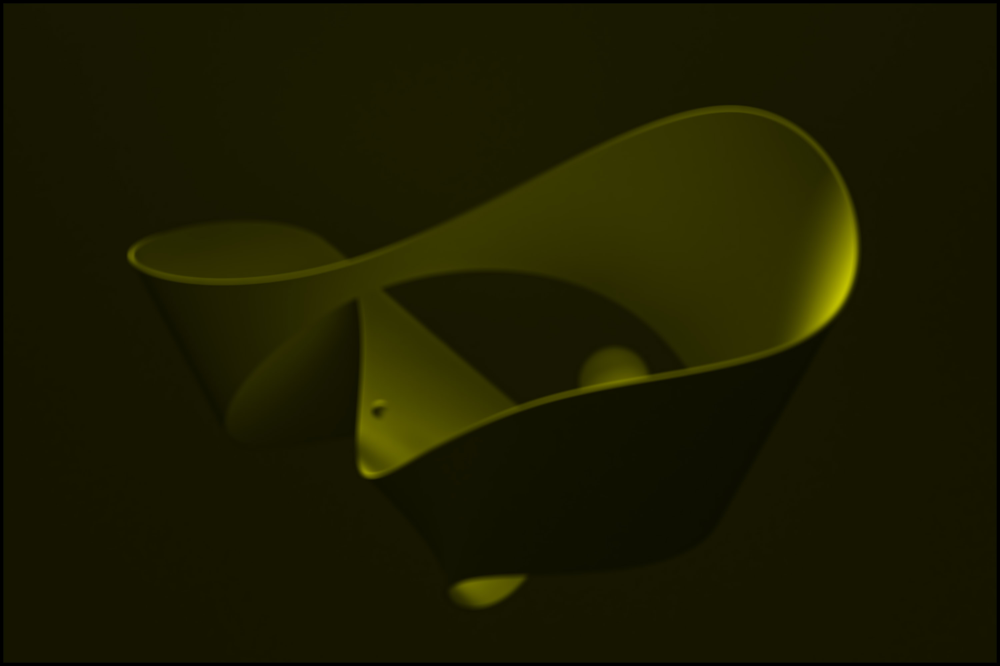 |
|  |  |
|  | 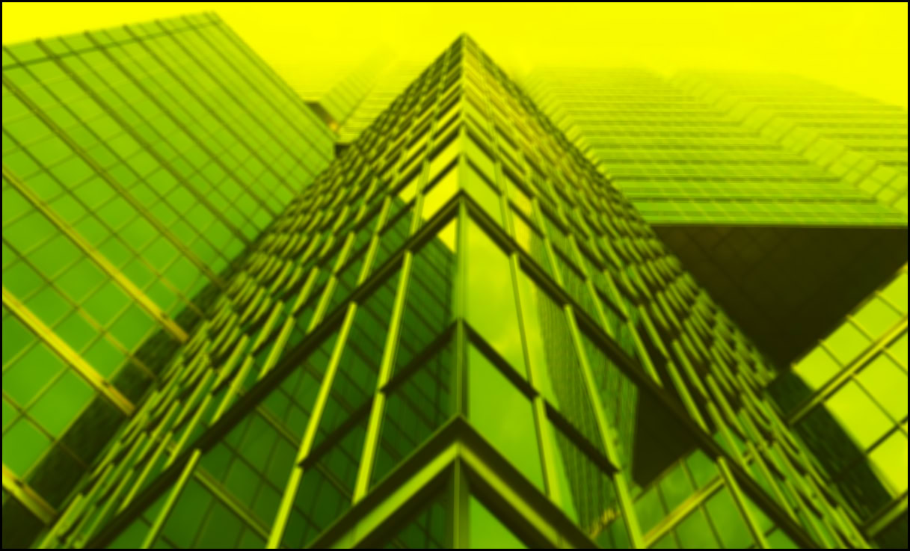 |
|  | 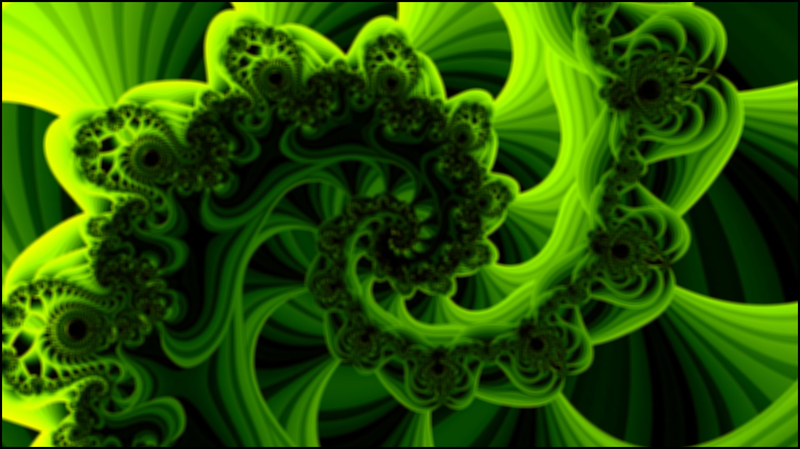 |
|  | 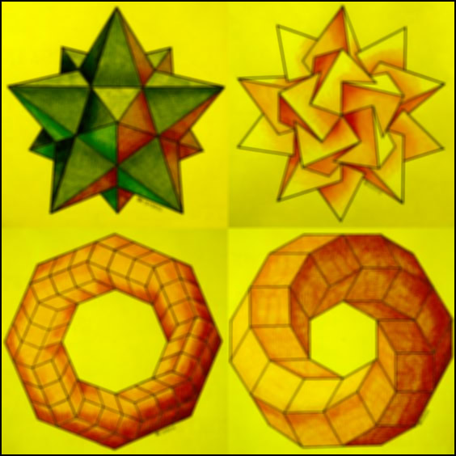 |
</details>

### Kernel: Glow G
<details>
<summary>Click to expand results</summary>

| Original | Processed |
| :---: | :---: |
|  | 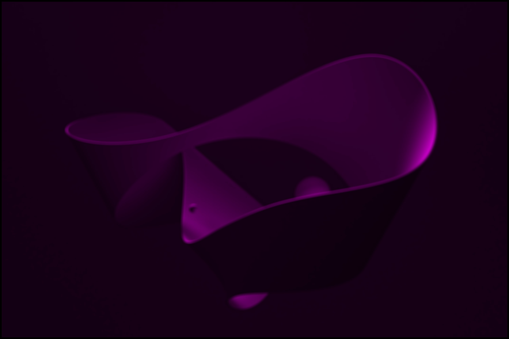 |
|  |  |
|  | 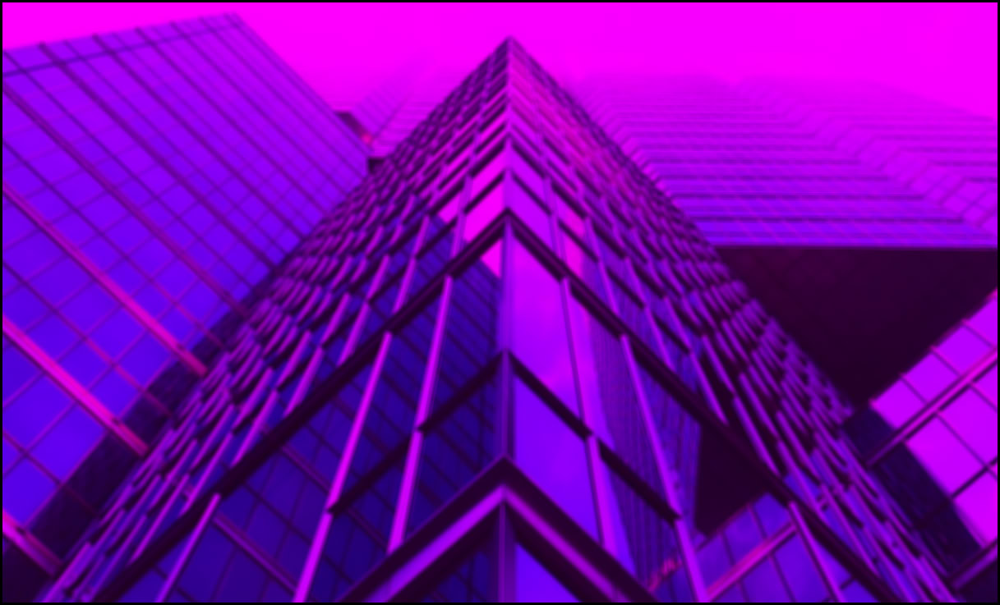 |
|  | 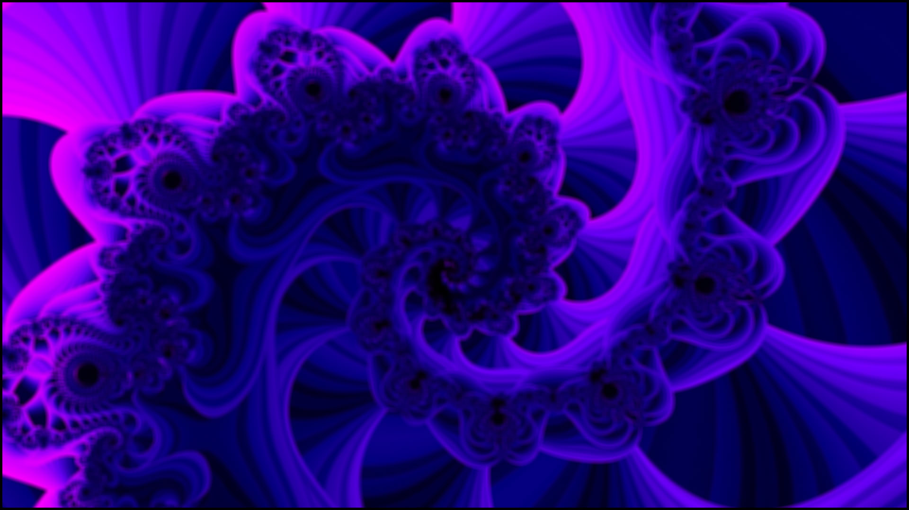 |
|  | 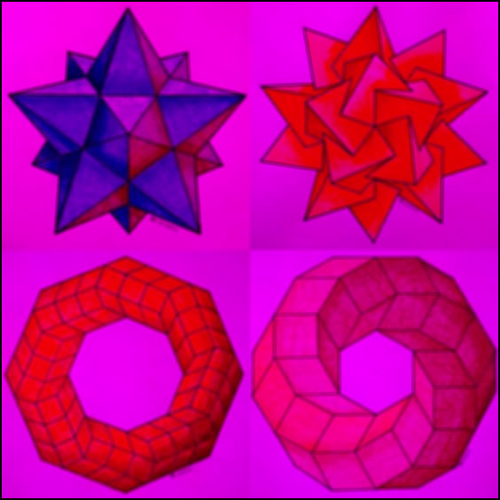 |
</details>

### Kernel: Glow R
<details>
<summary>Click to expand results</summary>

| Original | Processed |
| :---: | :---: |
|  | 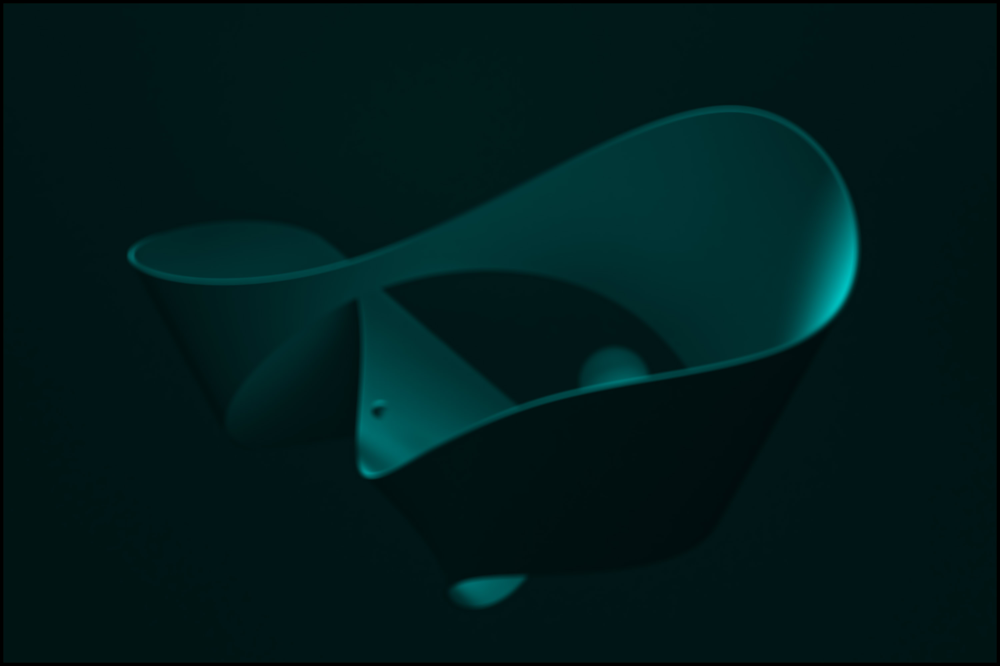 |
|  |  |
|  | 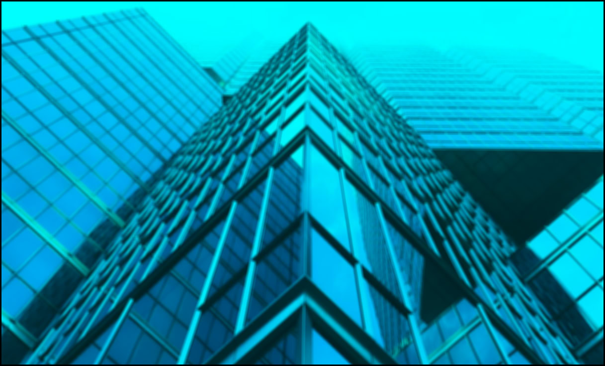 |
|  | 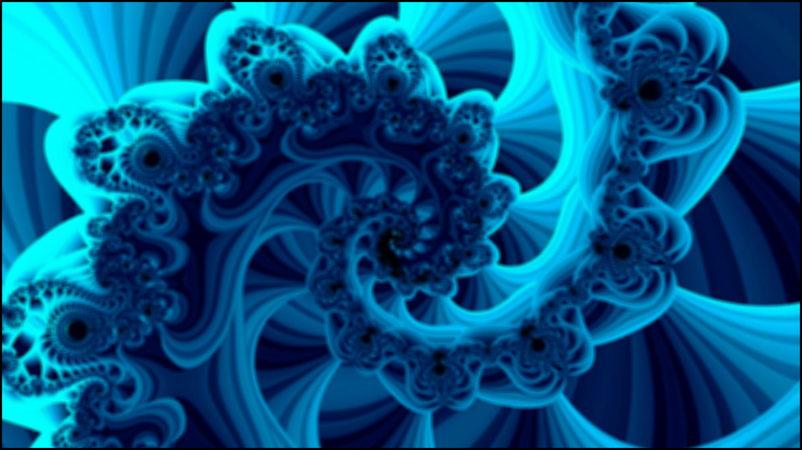 |
|  | 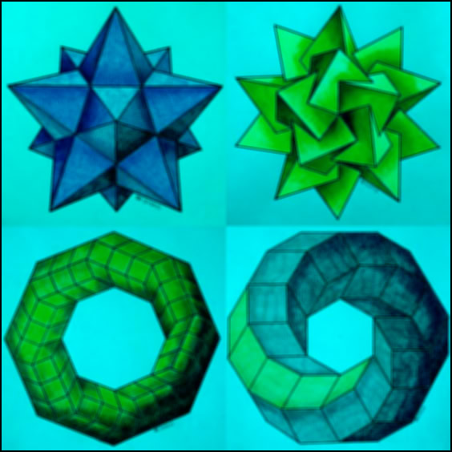 |
</details>

### Kernel: Identity
<details>
<summary>Click to expand results</summary>

| Original | Processed |
| :---: | :---: |
|  |  |
|  |  |
|  |  |
|  |  |
|  |  |
</details>

### Kernel: Laplacian 3
<details>
<summary>Click to expand results</summary>

| Original | Processed |
| :---: | :---: |
|  |  |
|  |  |
|  |  |
|  |  |
|  |  |
</details>

### Kernel: Laplacian 5
<details>
<summary>Click to expand results</summary>

| Original | Processed |
| :---: | :---: |
|  |  |
|  |  |
|  |  |
|  |  |
|  |  |
</details>

### Kernel: Motion Blur X
<details>
<summary>Click to expand results</summary>

| Original | Processed |
| :---: | :---: |
|  |  |
|  |  |
|  |  |
|  |  |
|  |  |
</details>

### Kernel: Motion Blur Y
<details>
<summary>Click to expand results</summary>

| Original | Processed |
| :---: | :---: |
|  |  |
|  |  |
|  |  |
|  |  |
|  |  |
</details>

### Kernel: Sharpen 3
<details>
<summary>Click to expand results</summary>

| Original | Processed |
| :---: | :---: |
|  |  |
|  |  |
|  |  |
|  |  |
|  |  |
</details>

### Kernel: Sharpen 5
<details>
<summary>Click to expand results</summary>

| Original | Processed |
| :---: | :---: |
|  |  |
|  |  |
|  |  |
|  |  |
|  |  |
</details>

### Kernel: Sobel X
<details>
<summary>Click to expand results</summary>

| Original | Processed |
| :---: | :---: |
|  |  |
|  |  |
|  |  |
|  |  |
|  |  |
</details>

### Kernel: Sobel Y
<details>
<summary>Click to expand results</summary>

| Original | Processed |
| :---: | :---: |
|  |  |
|  |  |
|  |  |
|  |  |
|  |  |
</details>

---
*README automatically generated on 2026-03-05 12:00:36 UTC*
